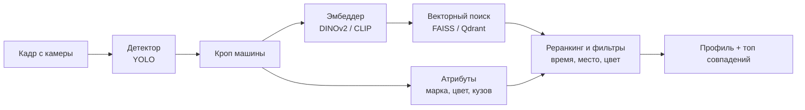

# ЛЦТ 2026 — Re-ID автомобилей: план команды

## 1. Как мы понимаем задачу

Нужен сервис повторной идентификации автомобиля (vehicle re-identification): по снимкам с городских камер находить одну и ту же машину без опоры на госномер, потому что номер бывает грязным, закрытым или не попадает в кадр.

- **Вход:** снимки с городских камер, разные ракурсы и освещение; для известных событий есть данные о номерах.
- **Выход:** «цифровой профиль» машины (марка, модель, тип кузова, цвет, геометрия, видимые особенности: наклейки, диски, тонировка, повреждения) и ранжированный список вероятных совпадений.
- **Результат:** работающий прототип, который сопоставляет снимки из разных локаций.
- **Компетенции в команде:** ML/CV, data science, backend, проектный менеджмент.

Задача делится на две подзадачи:

1. **Re-ID (главная):** обучить эмбеддинг машины и искать ближайших соседей по базе кадров.
2. **Атрибуты:** классификация марки, модели, кузова, цвета и поиск видимых особенностей.

**Что не проверено.** Описание взято из [публичного поста «Фалькон Тех» на Хабре](https://habr.com/ru/companies/falcontech/articles/1077254/). Страница на i.moscow закрыта логином, поэтому метрику, датасет от организаторов, критерии оценки, сроки и формат сдачи надо сверить с личным кабинетом.

## 2. Модель и подход

Делаем re-id как metric learning: детектор находит машину, эмбеддер превращает её в вектор, векторный поиск возвращает похожие кадры, отдельные головы считают атрибуты.

Слева направо: кадр → кроп машины → две параллельные ветки (эмбеддинг для поиска, атрибуты для профиля) → реранкинг → ответ.

| Блок | Что берём | Комментарий |
| --- | --- | --- |
| Детекция | YOLOv11 / YOLOv8 (Ultralytics), веса COCO | Почти без дообучения |
| Эмбеддер (baseline) | DINOv2 ViT-B/14 или CLIP ViT-L | Даёт результат без обучения, стартуем с него |
| Эмбеддер (дообучение) | Тот же бэкбон + LoRA, лосс Triplet + ArcFace, hard-negative mining | Классика: TransReID, OSNet, ResNet50-IBN |
| Атрибуты | Мультизадачные головы: марка, модель, кузов, цвет | Общий бэкбон с эмбеддером |
| «Особенности» (наклейки, тонировка, повреждения) | Zero-shot: CLIP или VLM (Qwen2-VL, Florence-2) | Быстрее, чем размечать свои данные |
| Поиск | FAISS или Qdrant / pgvector, косинусная близость | Реранкинг k-reciprocal |
| Контекст | Время и место съёмки камер | Отсекает физически невозможные совпадения |

**Рекомендация:** сначала baseline на DINOv2 или CLIP без обучения, замерить качество, и только потом дообучать. Так у команды с первого дня есть рабочая версия.

**Метрики качества:** mAP, CMC Rank-1 и Rank-5. Считаем сразу, чтобы видеть прогресс. Уточнить у организаторов, какая метрика у них главная.

## 3. Датасет

Обучаем на готовых re-id датасетах, а парсинг Drom/Avito используем для атрибутов (марка, модель) и как дополнительные пары ракурсов. Готовые датасеты надёжнее, потому что там снимки с настоящих камер.

| Датасет | Что внутри | Для чего |
| --- | --- | --- |
| VeRi-776 | ~50 тыс. снимков, 776 машин, камеры наблюдения | Основной re-id бенчмарк |
| VehicleID | ~200 тыс. снимков | Re-id, больше данных |
| VeRi-Wild | ~416 тыс. снимков, 40 тыс.+ машин, разные условия | Устойчивость к погоде и свету |
| CityFlow-ReID (AI City Challenge) | Городские камеры | Близко к нашей задаче |
| CompCars, Stanford Cars | Марка и модель | Обучение атрибутов |

Лицензии часто «только для исследований». Для хакатона это обычно нормально, но упомянем в презентации.

**Парсинг Drom.ru, Avito Авто, Auto.ru.**

- Плюс: российский рынок, точные метки марки, модели и поколения, несколько ракурсов одной машины (естественные положительные пары для re-id).
- Минус: снимки постановочные (студийный свет, чистый фон), а городские камеры дают низкое разрешение, вид сверху и ночь. Из-за разрыва доменов без аугментаций модель на камерах просядет.
- Юридически: проверить robots.txt и условия сайтов, ограничить частоту запросов, датасет не публиковать. Уточнить у организаторов, допустим ли такой источник.

**Как закрыть разрыв доменов.**

- Аугментации: blur, JPEG-сжатие, яркость и контраст, случайные обрезки, downscale, шум, имитация ночи.
- Кадры с открытых камер и видео с регистраторов, для self-supervised метки не нужны.
- Синтетика: генерация ракурсов и условий диффузией (ControlNet, img2img), по времени опционально.
- Проверить, дают ли организаторы свои данные: часто есть обучающая выборка и закрытый тест.

## 4. План реализации

Сначала работающий baseline сквозь весь пайплайн, потом улучшения модели. Обучение идёт на сервере с A100.

| Этап | Что делаем | Результат |
| --- | --- | --- |
| 0. Старт | Прочитать полную постановку и метрики на i.moscow, поднять окружение на A100, раздать роли | Один репозиторий, доступы, роли |
| 1. Baseline | YOLO + DINOv2/CLIP + FAISS, оценка на VeRi-776 (mAP, Rank-1) | Первые цифры качества |
| 2. Данные (параллельно) | Парсер Drom/Avito, скачать готовые датасеты, чистка и разметка марка/модель/цвет | Датасет атрибутов + пары для re-id |
| 3. Дообучение | ArcFace + triplet, аугментации под камеры, сравнение с baseline | Модель с улучшенными mAP/Rank-1 |
| 4. Атрибуты | Мультизадачные головы + VLM для «особенностей» | Цифровой профиль машины |
| 5. Интеграция | FastAPI, Postgres + pgvector или Qdrant, реранкинг, фильтры по времени и месту | Работающий бэкенд |
| 6. Продукт и демо | Веб-интерфейс, сценарий «найти машину с камеры A на камере B», презентация | Демо и слайды |
| 7. Финал | Оптимизация (ONNX / TensorRT), README, запись демо-видео | Готовая сдача |

**Роли в команде:**

- ML-инженер: модель re-id, обучение, метрики.
- Второй ML / data: парсинг, чистка, атрибуты.
- Backend: API, база, векторный поиск, деплой.
- Frontend / дизайн: демо-интерфейс.
- PM: презентация, связь с организаторами, контроль сроков и метрик.

**Стек:** PyTorch, timm, HuggingFace, Ultralytics, FAISS / Qdrant, FastAPI, Docker, React или Streamlit / Gradio.

## 5. Какой продукт нужен в конце

В финале нужен веб-сервис с API, а не одиночный скрипт: постановка требует «работающий прототип, сопоставляющий снимки из разных локаций и выдающий список вероятных совпадений». Мобильное приложение не нужно.

- **Веб-демо** (React или Streamlit): загружаем фото или кадр, видим цифровой профиль (марка, модель, цвет, особенности) и ранжированные совпадения с процентом уверенности, камерой и временем.
- **REST API** (FastAPI) под ним, чтобы решение можно было встроить в городские системы.
- **База кадров для демо:** пара сотен машин, каждая на нескольких «камерах».
- **Презентация и короткое видео-демо.** Их оценивают не меньше кода.

Лучший сценарий для показа: «по фото с камеры A найти ту же машину на камере B, даже если номер не виден». Красивый интерфейс добавляет баллов, но приоритет у качества re-id.

## 6. Открытые вопросы и риски

Главный риск: мы не видели полный текст задачи на i.moscow, и от него зависит, что оптимизировать.

- [ ] Какая метрика и критерии оценки у организаторов?
- [ ] Дают ли организаторы свой датасет и какой у него формат и объём?
- [ ] Какие сроки и формат сдачи (репозиторий, демо, презентация, защита)?
- [ ] Можно ли парсить Drom и Avito для обучения по правилам хакатона?
- [ ] Есть ли ограничения на модели и вычисления (сервер с A100 только для обучения или и для демо)?

| Риск | Что делаем |
| --- | --- |
| Разрыв доменов: студийные фото с сайтов не похожи на кадры камер | Реальные re-id датасеты + жёсткие аугментации |
| Юридические ограничения парсинга | Сначала готовые датасеты, парсинг как дополнение, уточнить у организаторов |
| Мало времени на дообучение | Baseline готов в первый день, демо не зависит от дообучения |
| Непонятная метрика оценки | Считать mAP и Rank-1, уточнить у организаторов |

## Sources

- [Компания «Фалькон Тех» стала партнером хакатона Мэра Москвы «Лидеры цифровой трансформации» (Хабр)](https://habr.com/ru/companies/falcontech/articles/1077254/)
- [Хакатон ЛЦТ 2026: регистрация, задачи и призы (i.moscow/lct)](https://i.moscow/lct)
